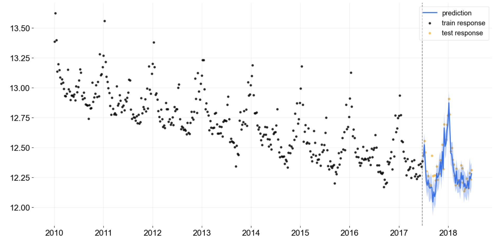

-------------------------------------------------------------------------------------------------------------------------------------


[](https://github.com/uber/orbit/actions)
[](https://orbit-ml.readthedocs.io/en/latest/?badge=latest)

[](https://pepy.tech/project/orbit-ml)

# Users Notice

The default page of the repo is on `dev` branch. To install the version, please check the `Installing from Dev Branch` section. If you are looking for a **stable version**, please refer to the `master` branch [here](https://github.com/uber/orbit/tree/master).


# Disclaimer

This project

- is stable and being incubated for long-term support. It may contain new experimental code, for which APIs are subject to change.
- requires PyStan as a system dependency. PyStan is licensed under [GPLv3](https://www.gnu.org/licenses/gpl-3.0.html), which is a free, copyleft license for software.

# Orbit: A Python Package for Bayesian Forecasting

Orbit is a Python package for Bayesian time series forecasting and inference. It provides a
familiar and intuitive initialize-fit-predict interface for time series tasks, while utilizing probabilistic programming languages under the hood.

For details, check out our documentation and tutorials:
- HTML (stable): https://orbit-ml.readthedocs.io/en/stable/
- HTML (latest): https://orbit-ml.readthedocs.io/en/latest/

Currently, it supports concrete implementations for the following models:

-  Exponential Smoothing (ETS)
-  Local Global Trend (LGT)
-  Damped Local Trend (DLT)
-  Kernel Time-based Regression (KTR)

It also supports the following sampling/optimization methods for model estimation/inferences:

-  Markov-Chain Monte Carlo (MCMC) as a full sampling method
-  Maximum a Posteriori (MAP) as a point estimate method
-  Variational Inference (VI) as a hybrid-sampling method on approximate
   distribution


##  Installation
### Installing Stable Release

Install from PyPi:
```shell
$ pip install orbit-ml
```

Install from source:
```shell
$ git clone https://github.com/uber/orbit.git
$ cd orbit
$ pip install -r requirements.txt
$ pip install .
```

### Installing from Dev Branch
```shell
$ pip install git+https://github.com/uber/orbit.git@dev
```

## Quick Start with Damped-Local-Trend (DLT) Model
### FULL Bayesian Prediction

```python
from orbit.utils.dataset import load_iclaims
from orbit.models import DLT
from orbit.diagnostics.plot import plot_predicted_data

# log-transformed data
df = load_iclaims()
# train-test split
test_size = 52
train_df = df[:-test_size]
test_df = df[-test_size:]

dlt = DLT(
  response_col='claims', date_col='week',
  regressor_col=['trend.unemploy', 'trend.filling', 'trend.job'],
  seasonality=52,
)
dlt.fit(df=train_df)

# outcomes data frame
predicted_df = dlt.predict(df=test_df)

plot_predicted_data(
  training_actual_df=train_df, predicted_df=predicted_df,
  date_col=dlt.date_col, actual_col=dlt.response_col,
  test_actual_df=test_df
)
```



## Demo 

Forecasting / Nowcasting with Regression in DLT (based on v1.0.13):

[](https://colab.research.google.com/drive/1kStoPB_Xo3yDy_n_qqh5_jRpHt_RcDkV?usp=sharing)

Backtest on M3 Data:

[](https://colab.research.google.com/github/edwinnglabs/ts-playground/blob/master/orbit_m3_backtest.ipynb)

More examples can be found under [tutorials](https://github.com/uber/orbit/tree/dev/docs/tutorials)
and [examples](https://github.com/uber/orbit/tree/dev/examples).

# Contributing
We welcome community contributors to the project. Before you start, please read our
[code of conduct](https://github.com/uber/orbit/blob/dev/CODE_OF_CONDUCT.md) and check out
[contributing guidelines](https://github.com/uber/orbit/blob/dev/CONTRIBUTING.md) first.


# Versioning
We document versions and changes in our [changelog](https://github.com/uber/orbit/blob/dev/docs/changelog.rst).


# References

## Presentations

Check out the ongoing [deck](https://docs.google.com/presentation/d/1pzpMubCWfjtoiyTug1yLu6ILfFsBdaQJQC8qTj99ZyM/edit?usp=sharing) for scope and roadmap of the project. An older deck used in the [meet-up](https://www.meetup.com/UberEvents/events/279446143/) during July 2021 can also be found [here](https://docs.google.com/presentation/d/1R0Ol8xahIE6XlrAjAi0ewu4nRxo-wQn8w6U7z-uiOzI/edit?usp=sharing).


## Citation

To cite Orbit in publications, refer to the following whitepaper:

[Orbit: Probabilistic Forecast with Exponential Smoothing](https://arxiv.org/abs/2004.08492)

Bibtex:
```
@misc{
    ng2020orbit,
    title={Orbit: Probabilistic Forecast with Exponential Smoothing},
    author={Edwin Ng,
        Zhishi Wang,
        Huigang Chen,
        Steve Yang,
        Slawek Smyl},
    year={2020}, eprint={2004.08492}, archivePrefix={arXiv}, primaryClass={stat.CO}
}
```

##  Papers

- Bingham, E., Chen, J. P., Jankowiak, M., Obermeyer, F., Pradhan, N., Karaletsos, T., Singh, R., Szerlip,
  P., Horsfall, P., and Goodman, N. D. Pyro: Deep universal probabilistic programming. The Journal of Machine Learning
  Research, 20(1):973–978, 2019.
- Hoffman, M.D. and Gelman, A. The No-U-Turn sampler: adaptively setting path lengths in Hamiltonian Monte Carlo.
  J. Mach. Learn. Res., 15(1), pp.1593-1623, 2014.
- Hyndman, R., Koehler, A. B., Ord, J. K., and Snyder, R. D. Forecasting with exponential smoothing:
  the state space approach. Springer Science & Business Media, 2008.
- Smyl, S. Zhang, Q. Fitting and Extending Exponential Smoothing Models with Stan.
  International Symposium on Forecasting, 2015.

## Related projects

- [Pyro](https://github.com/pyro-ppl/pyro)
- [Stan](https://github.com/stan-dev/stan)
- [Rlgt](https://cran.r-project.org/web/packages/Rlgt/index.html)
- [forecast](https://github.com/robjhyndman/forecast)
- [prophet](https://facebook.github.io/prophet/)
